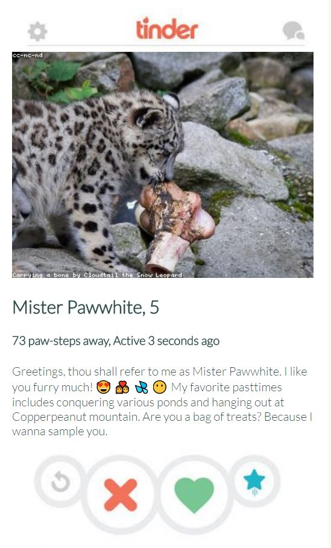
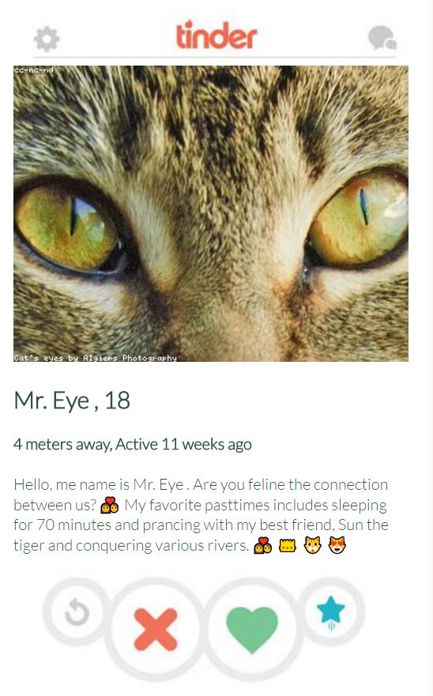

#Tinder For Cats Generator
Tinder For Cats is a Tracery grammar implementation of everyone's favorite hook up app, Tinder but with cats.

###Images
 

###How Run The Generator
1. Clone the repo to a location on your desktop.
2. Double click on the index.html to open it up on your favorite broswer
3. On the sidebar to the right, under grammar select: "TinderForCats"
4. On count, select the appropiate number of cat tinder profiles you wish to generate.
5. Tinder profiles should be automatically generating as you make these selections. Refresh the page for more generations!

###How to Modify Grammar
Please go to Tracery below to understand the syntax. The grammar is located in "grammar.js" in the js folder. Feel free to do a pull request to add your very own CAT-astrophic cat puns.

###Twitter Bot Implementation
####Coming Soon

###Credits
Thanks to Galaxy Kate for [Tracery](https://github.com/galaxykate/tracery)
Developed by Sarah Borland